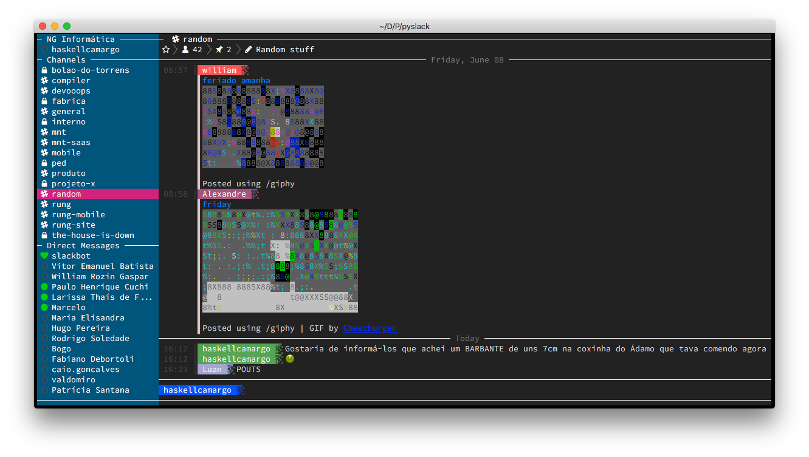

# Sclack

> The best CLI client for Slack, because everything is terrible!



## Setup

The first thing you need to do is to get a [Slack token here](https://api.slack.com/custom-integrations/legacy-tokens).
Use, create or request a token for each workspace that you'll use on Sclack.
Not all workspaces allow you to generate a token, so sometimes you'll need to
ask for the administrator to enable the feature.

## Optional Dependencies

### Nerd Fonts

Sclack seems better when used with a [Nerd Font](https://nerdfonts.com/). Using
them is completely optional, but it is how some Sclack icons are possible.
Personally, I use [Fire Code Nerd Font](https://github.com/ryanoasis/nerd-fonts/releases/download/v2.0.0/FiraCode.zip).
Download, install and set as the default font of your terminal emulator.

### libcaca

Sclack uses `caca-utils` to create ANSI/VT100 + ASCII versions of pictures and
render them. Images will only be rendered if both `caca-utils` is installed
and `features.pictures` is configured to `true`. To install `caca-utils`, just
run `sudo apt-get install caca-utils` on Debian and `brew install caca-utils` on
OS X.

## Installation

### Using pip

`pip install sclack`

### From Source

Ensure you have Python 3.4 or superior version.

```bash
git clone https://github.com/haskellcamargo/sclack.git
cd sclack
pip install -r requirements.txt
chmod +x ./app.py
./app.py
```

### From Binary

If you don't have Python installed, you can get the compiled binary for Sclack
on [releases](https://github.com/haskellcamargo/sclack/releases) page. Versions are
available for Linux x86/x64 and OS X.

## Tested Terminals

Sclack has been tested with the following terminal emulators:

- iTerm2
- QTerminal
- Terminal (OS X)
- Terminator
- XTerm

## Contributing

Contributions are very welcome, and there is a lot of work to do! You can...
- Check out our [open issues](https://github.com/haskellcamargo/sclack/issues)
- Provide bug reports
- Create packages for apt, dnf, rpm, pacman and brew
- Improve documentation

<p align="center">Made with :rage: by <a href="https://github.com/haskellcamargo">@haskellcamargo</a></p>
